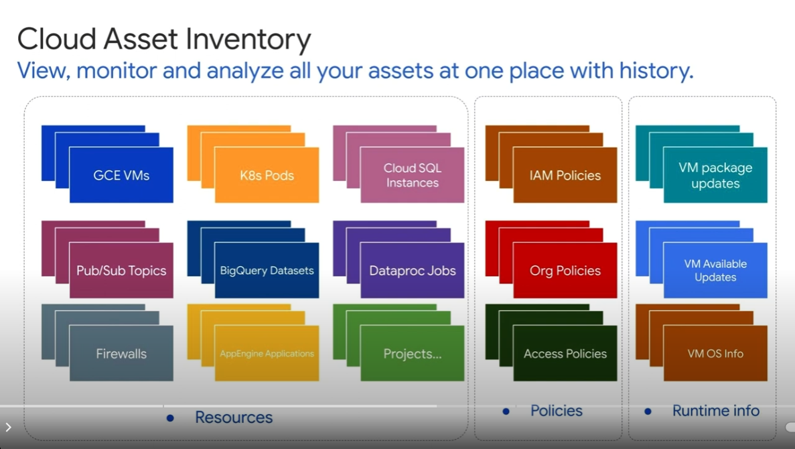

## 1. What is google-cloud-asset?

**google-cloud-asset** isn't a Java Client Library but rather a managed service that tracks and provides inventory data for your Google Cloud resources. It offers a unified view of various resources across services like GKE, GCE, App Engine, and more, including:
- Compute resources like VMs, disks, and networks.
- Storage resources like buckets and objects.
- Big data resources like clusters and tables.
- Kubernetes resources like clusters, pods, and deployments.
- IAM policies and other configurations.

## 2. Generating Resource Lists with google-cloud-asset:

- You can access google-cloud-asset through its REST API or client libraries (available in various languages, including Java).
- You can query the inventory data by filtering based on various criteria like resource type, project, state (active, running, etc.), and more.
- The service offers historical data, allowing you to analyze resource changes over time.

## 3. GCP Service and Roles/Permissions at Organization Level:

- To use google-cloud-asset at the organization level, you need the following:
    - Enabled Service: The Cloud Asset Inventory API must be enabled at the organization level.
        - Roles:
            - Organization Viewer (roles/resourcemanager.viewer): Allows reading resource inventory data across the organization.
            - Asset Viewer (roles/cloudasset.viewer): Provides more granular access to asset data, including resource type and state information.

You might need additional permissions at the project level to access specific resources within those projects.

## 4. Advantages of Using google-cloud-asset:

- Saves development time by eliminating the need to build custom scripts or logic to collect resource data from individual services.
- Offers a unified view of resources across diverse services, simplifying resource management and analysis.
- Provides historical data for insightful tracking of resource changes and optimizations.

## 5. Considerations:

- google-cloud-asset incurs additional costs based on the amount of data stored and queries performed.
    - **Data storage**:
        - $0.0025 per GB per month for the first 10 TB of data stored.
        - $0.0020 per GB per month for data stored over 10 TB.
    - **API calls**:
        - Free quota: Up to 50,000 API calls per month are free.
        - Excess API calls: $0.005 per 1000 API calls after the free quota is exhausted.

- It might not be the best option if you only need data from a handful of specific services.

## 6. Google Cloud Asset Inventory does include containers in GKE, but with some nuances to consider:
- **Container Inventory:** It captures information about GKE clusters, nodes, pods, and deployments, but it doesn't provide granular details about individual containers within pods.
- **Container Images:** It tracks container images stored in Artifact Registry, but not those pulled from external registries.
- To obtain more comprehensive container data, you'll likely need to combine Cloud Asset Inventory with other tools or services:
  - GKE APIs or Client Libraries: Use these to directly query the GKE API for detailed information about containers, images, and their configurations.
    
## 7. GKE resources typically returned by the Asset Inventory tool and Assets API:
- **Clusters:**
    - Representations of GKE clusters, including their names, locations, and configurations.
- **Nodes:**
    - Individual virtual machines within GKE clusters, providing their names, machine types, and status.
- **Namespaces:**
    - Virtual clusters within a GKE cluster, used for resource isolation and organization.
- **Pods:**
    - Groups of containers that make up the basic units of deployment in Kubernetes.
- **Deployments:**
    - Objects that manage the lifecycle of pods, ensuring a specified number of replicas are always running.
- **Services:**
    - Abstractions that define a logical set of pods and a policy for accessing them.
- **PersistentVolumeClaims (PVCs):**
    - Requests for storage resources within a GKE cluster, used by pods to access persistent data.
- **ServiceAccounts:**
    - Identities used by pods to interact with the Kubernetes API.

### Key Points:

**Level of Detail:** The Asset Inventory tool and Assets API typically provide a high-level overview of GKE resources, including their names, types, and basic configurations.
**Customization:** You can use filters and queries to refine the results and focus on specific resource types or attributes.
**Additional Information:** For more granular details about individual resources, you might need to use the GKE API directly.

### Additional Considerations:

**Node Labels:** Node labels, which are key-value pairs attached to nodes, are usually not included in the Asset Inventory results.
**Cluster Network Information:** Detailed cluster network information, such as IP addresses and subnets, might not be fully available through these tools.

Overall, google-cloud-asset can be a powerful tool for generating a comprehensive list of active and running resources across your GCP environment at the organization level. Weigh its advantages and costs against your specific needs and development resources to determine if it's the right solution for your task.
